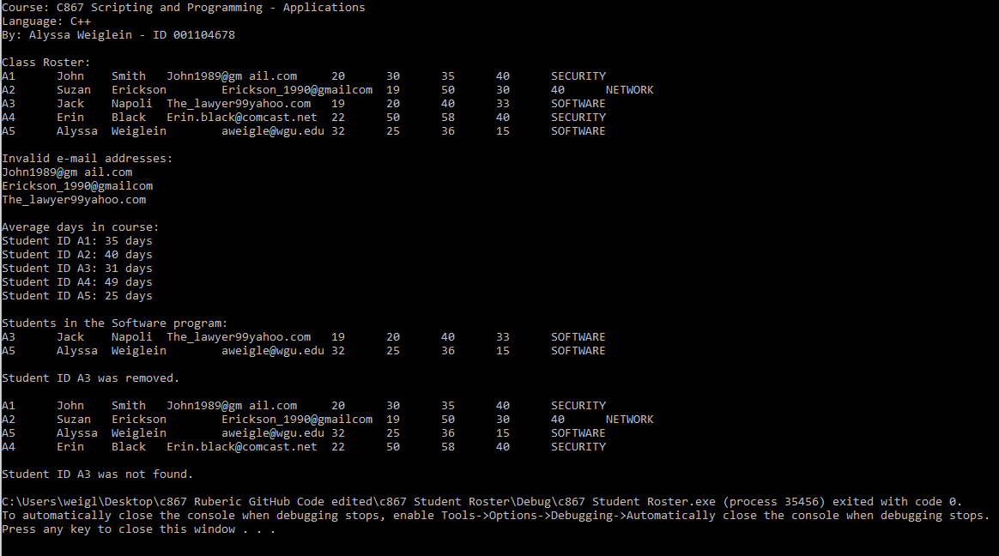

# ClassRoster
Application used to maintain a current roster of students within a given course.
  

  

<h2>The Challenge</h2>
  
You are hired as a contractor to help a university migrate an existing student system to a new platform using C++ language. Since the application already exists, its requirements exist as well, and they are outlined in the next section. You are responsible for implementing the part of the system based on these requirements. A list of data is provided as part of these requirements. This part of the system is responsible for reading and manipulating the provided data.
  
You must write a program containing two classes (i.e., Student and Roster). The program will maintain a current roster of students within a given course. Student data for the program include student ID, first name, last name, email address, age, an array of the number of days to complete each course, and degree program. This information can be found in the “studentData Table” below. The program will read a list of five students and use function calls to manipulate data (see part F4 in the requirements below). While parsing the list of data, the program should create student objects. The entire student list will be stored in one array of students called classRosterArray. Specific data-related output will be directed to the console.

  

<h2>Project Requirements</h2>
<ul>
  <li>Create a C++ project in your integrated development environment (IDE)</li>
  <li>Define an enumerated data type DegreeProgram for the degree programs containing the data type values SECURITY, NETWORK, and SOFTWARE.</li>
  <li>Create the class Student in the files student.h and student.cpp</li>
  <li>Create each of the following functions in the Student class:
    <ul class="square">
      <li>an accessor (i.e., getter) for each instance variable</li>
      <li>a mutator (i.e., setter) for each instance variable</li>
      <li>All external access and changes to any instance variables of the Student class must be done using accessor and mutator functions.</li>
      <li>constructor using all of the input parameters provided in the table</li>
      <li>print() to print specific student data</li>
    </ul>
  <li>Create a Roster class (roster.cpp)</li>
  <li>Demonstrate the program’s required functionality by adding a main() function in main.cpp, which will contain the required function calls</li>
</ul>
  

<h2>The Solution</h2>
<ul>
  </li></li>
</ul>
